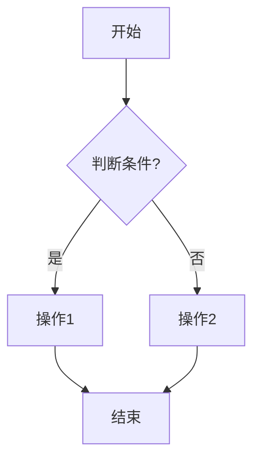
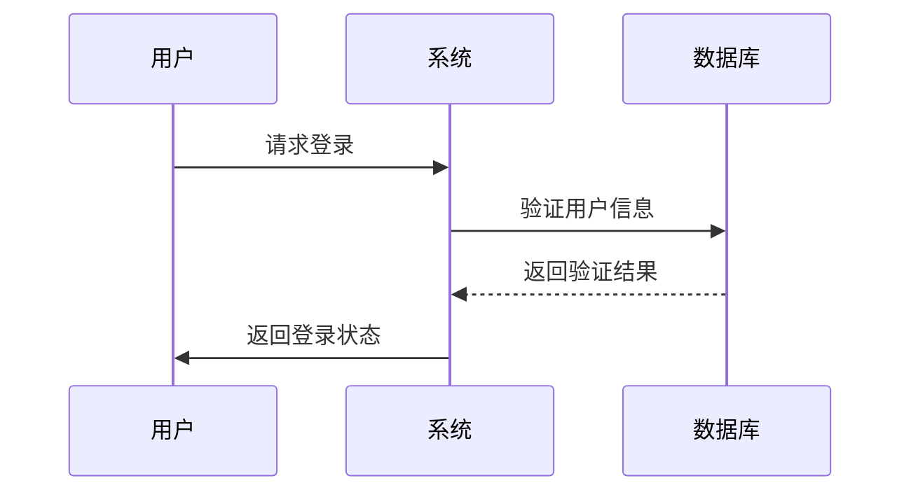
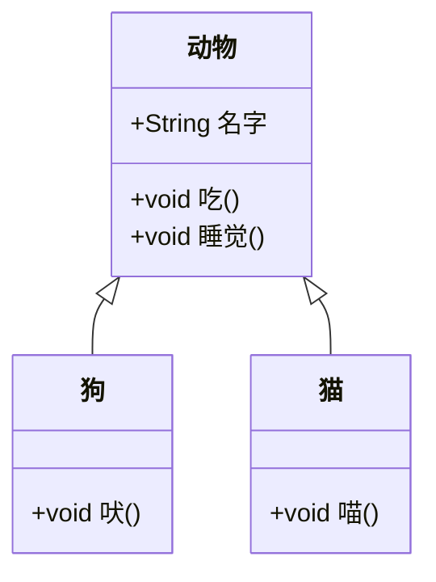
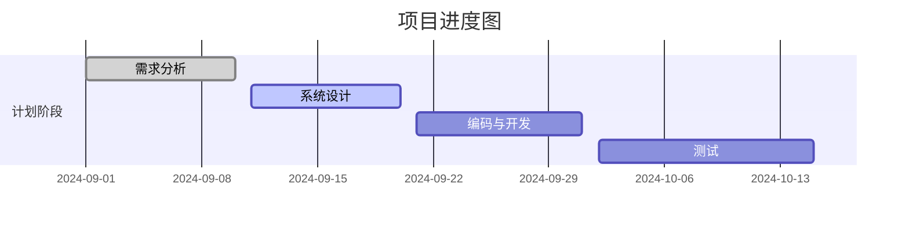
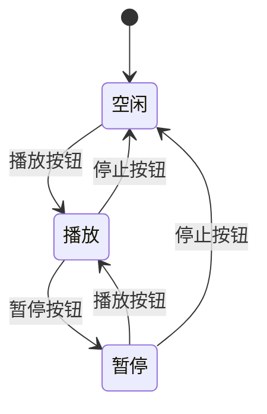
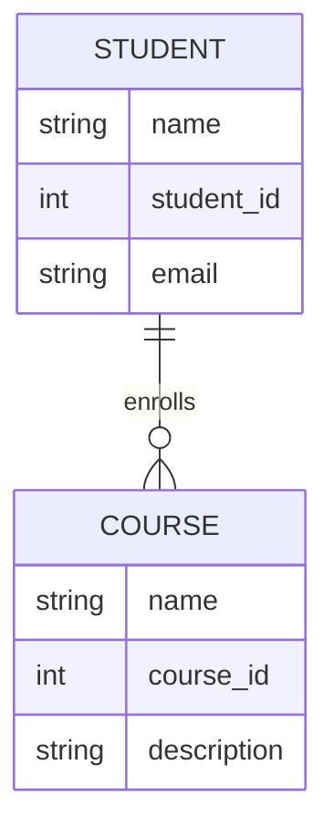
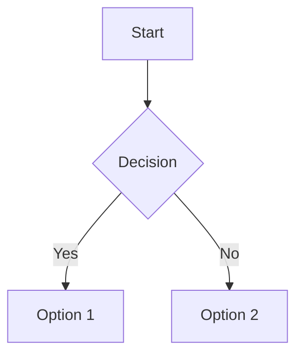

为什么 Mermaid 可以提高流程图绘制效率？
专注于内容： 使用 Mermaid 的语法，用户只需要编写描述流程的简单代码，而不必耗费大量精力在图形元素的排列、调整尺寸、样式美化等繁琐操作上。这种方式让用户可以集中精力思考流程的逻辑，而不是图形化的细节。

自动渲染： Mermaid 会根据代码自动生成并渲染图表，将复杂的图形布局交给工具完成。这使得创建和修改图表变得更加轻松。比如，如果有新的节点加入，只需在代码中插入相应的定义，工具会自动调整整体布局。

减少重复劳动： 在传统的图形绘制工具（例如 Visio、Lucidchart 等）中，调整节点位置、线条等需要花费大量时间。而 Mermaid 的文本驱动方式，通过修改几行代码，就能迅速更新并重新渲染流程图，大大减少了手动调整的时间。

易于版本控制和协作： Mermaid 以文本的形式描述图表，这意味着它的流程图是以代码的形式存储的。这样就可以方便地集成到版本控制系统（如 Git）中，便于团队协作和版本管理。而传统的图形工具生成的是二进制文件，无法方便地进行差异比较和合并操作。

简单上手，适合开发者和非技术人员： Mermaid 语法直观，容易学习和使用。开发者会觉得它类似于编写代码，而对非技术人员而言，学习 Mermaid 语法所需的门槛也很低，因此它适用于广泛的用户群体。

动态展示与集成： 在一些 Web 应用（例如 Decision App）中，可以将 Mermaid 作为一个嵌入式工具，让用户实时看到他们输入代码所产生的流程图效果，这种即时反馈非常适合用来指导用户的决策流程，且大大增强了交互体验。

如何提高用户使用 Mermaid 的体验？
为了让用户专注于 Mermaid 代码的编写，可以采取以下措施：

实时预览功能：在用户输入 Mermaid 代码的同时，在页面右侧或下方实时渲染出对应的流程图。这种所见即所得的体验能帮助用户快速检查流程图的可视化效果。
代码编辑辅助：为 Mermaid 编辑器集成语法高亮、自动补全等功能，帮助用户更直观地看到节点之间的关系，提升编写代码的效率。
模板功能：提供一些常见的流程图模板，用户只需要进行少量修改即可得到适合自己的流程图，进一步减少手动编写的工作量。
用 Mermaid 在 Decision App 中绘制流程图的场景
决策流程展示：用户可以通过 Mermaid 绘制出他们决策过程的整体流程图，从最初的目标设定，到各个步骤的行动计划与判断条件。
复盘过程可视化：在复盘的功能中，用户可以通过 Mermaid 流程图的形式，将他们复盘的思考步骤可视化，帮助他们更直观地看到决策过程中做得好的部分和需要改进的环节。
Mermaid 的强大在于它提供了一种轻量、高效的图表描述方法，非常适合像 Decision App 这样需要用户快速理清思路并将其以图形化呈现的应用场景。这样的方式不但能提升用户的使用体验，还能让他们更好地聚焦于思维本身，从而做出更加科学、系统的决策。

Mermaid 是一个可以用简单的文本描述来创建复杂图表的工具，包括流程图、序列图、甘特图等。它使用一种轻量级的语法，允许你快速地创建图表并在网页中可视化显示。以下是 Mermaid 各种图表类型及其主要语法的详细说明。

1. 流程图（Flowchart）
Mermaid 支持创建流程图，允许用箭头连接不同的节点来表示不同的步骤。

基本语法

说明
graph 定义图表的方向：
TD (Top to Down)：从上到下。
LR (Left to Right)：从左到右。
BT (Bottom to Top)：从下到上。
RL (Right to Left)：从右到左。
节点的定义：
A[文本] 表示一个矩形节点。
B{文本} 表示一个菱形节点（通常用于表示决策）。
C((文本)) 表示一个圆形节点。
连接线：
使用 --> 表示从一个节点指向另一个节点的箭头。
使用 -->|文本| 表示带标签的箭头。

2. 序列图（Sequence Diagram）
用于描述各个实体之间的交互过程。

基本语法

说明
sequenceDiagram 定义序列图。
participant 定义参与者，A as 用户 表示将 A 定义为 "用户"。
箭头类型：
->> 表示消息发送，右箭头表示主动请求。
-->> 表示响应消息或被动的消息。

3. 类图（Class Diagram）
用于创建 UML 类图，展示类与类之间的关系。

基本语法

说明
classDiagram 定义类图。
类的定义：
使用 class 类名 表示定义一个类。
+ 表示公有属性或方法，- 表示私有属性或方法。
关系：
<|-- 表示继承关系。

4. 甘特图（Gantt Chart）
用于显示项目的时间安排。

基本语法

说明
gantt 定义甘特图。
title 设置甘特图的标题。
dateFormat 指定日期格式。
section 定义不同的阶段，阶段下面列出任务。
任务的状态：
done：表示任务已完成。
active：表示任务正在进行。
空：表示尚未开始。
5. 状态图（State Diagram）
用于描述一个系统在特定状态之间的转换。

基本语法

说明
stateDiagram-v2 定义状态图。
[ * ] 表示开始状态。
--> 表示状态之间的转换。

6. 实体关系图（ER Diagram）
用于描述实体和实体之间的关系。

基本语法

说明
erDiagram 定义实体关系图。
实体的定义：
STUDENT {} 定义一个实体，并列出属性。
关系：
||--o{ 表示多对多关系，enrolls 表示关系名称。
Mermaid 使用案例
你可以在网页中嵌入 Mermaid 图表，比如在 Markdown 文档中，常见的用法是：

### 总结
- **流程图**：用于表示各种步骤、分支的关系。
- **序列图**：用于表示交互过程和时间顺序。
- **类图**：用于 UML 设计。
- **甘特图**：用于项目管理和时间进度显示。
- **状态图**：用于状态和转换展示。
- **实体关系图**：用于描述数据库结构。

这些语法使得 Mermaid 非常强大且灵活，适用于从简单流程图到复杂图表的创建，能够很好地辅助开发、演示和决策过程。它与 Markdown 的集成让它特别适合用于文档和决策工具中。 

你觉得哪些类型的图表最适合用于 **Decision App** 来帮助用户更好地理解决策流程呢？
