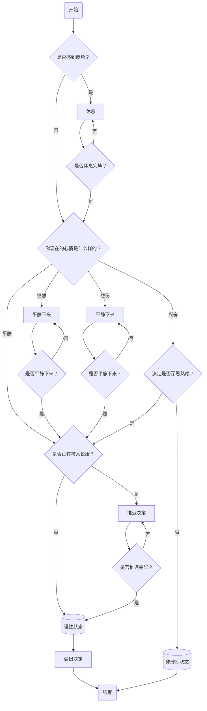

我想在Decision App的做决定组件ChecklistDetail的前面加上一个个人状态检测的流程，
整个流程通过一系列问题引导个人评估自己的状态，确保在做出重要决定之前处于最佳的心理状态。如果任何时候个人感到不理性，流程将引导他们推迟决定，直到他们感到更加理性和平静。流程的过程如下，
1. **开始**：流程的起点。
2. **是否感到疲惫？**：首先问自己是否感到疲惫。
   - 如果是，进行休息。
   - 如果否，进入下一个检查点。
3. **休息**：如果感到疲惫，进行休息。
   - 休息完毕后，问自己是否已经休息完毕。
   - 如果是，进入下一个检查点，即你现在的心情是什么样的？
   - 如果否，继续休息。
4. **你现在的心情是什么样的？**
   - 如果愤怒，尝试平静下来。
   - 如果悲伤，尝试平静下来。
   - 如果兴奋，进入下一个检查点，即决定是否深思熟虑？
   - 如果平静，进入下一个检查点，即是否正在被人说服？
5. **平静下来**：如果感到愤怒或者悲伤，尝试平静下来。
   - 平静下来后，问自己是否已经平静。
   - 如果是，进入下一个检查点，即是是否正在被人说服？
   - 如果否，继续尝试平静。
6. **决定是否深思熟虑？**：如果感到兴奋，判断自己的决定是否是慎重的。
   - 如果是，进入下一个检查点，即是否正在被人说服。
   - 如果否，进入非理性状态并结束流程。
7. **是否正在被人说服？**：判断自己是否正在被人说服。
   - 如果是，推迟决定，直到进入理性状态。
   - 如果否，如果之前没有进入非理性状态，则直接进入理性状态。
8. **推迟决定**：如果正在被人说服或需要进一步思考，推迟决定。
    - 推迟完毕后，进入理性状态。
9. **理性状态**：当感到理性时，可以做出决定。
10. **做出决定**：在理性状态下做出最终决定。
11. **结束**：流程的终点。

使用mermaid的流程代码描述如下
